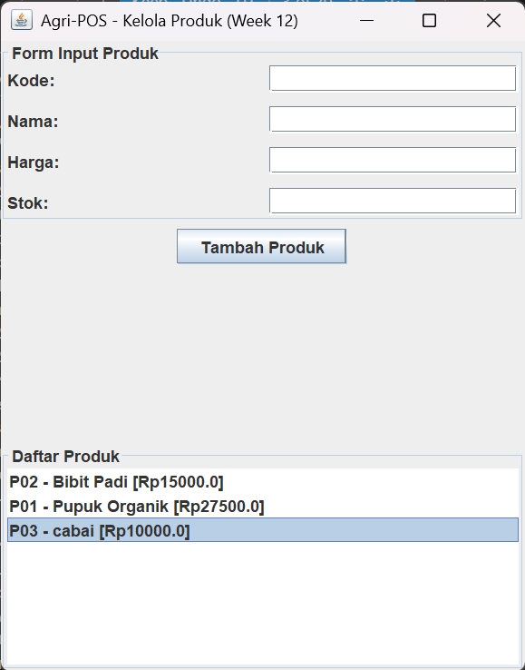

# Laporan Praktikum Minggu 1 (sesuaikan minggu ke berapa?)
Topik: [Tuliskan judul topik, misalnya "Class dan Object"]

## Identitas
- Nama  : [Zaki Saputra]
- NIM   : [240202847]
- Kelas : [3IKRA]

---

## Tujuan
(
1. Mahasiswa mampu membangun antarmuka grafis (GUI) menggunakan JavaFX.

2. Mahasiswa memahami konsep Event-Driven Programming melalui penanganan aksi tombol (Event Handling).

3. Mahasiswa mampu mengintegrasikan GUI dengan backend (Service & DAO) yang telah dibuat sebelumnya.

4. Mahasiswa mampu merealisasikan desain UML (Bab 6) ke dalam implementasi kode nyata secara konsisten.)

---

## Dasar Teori
(
1. Event-Driven Programming: Paradigma pemrograman di mana alur eksekusi program ditentukan oleh peristiwa (event) seperti klik mouse, penekanan tombol, atau input sensor.

2. JavaFX: Framework modern Java untuk membangun aplikasi desktop yang kaya fitur. Komponen utamanya meliputi Stage (jendela), Scene (kontainer konten), dan Nodes (elemen UI seperti Button, TextField).

3. Traceability: Kemampuan untuk menelusuri implementasi kode kembali ke dokumen desain (Bab 6) guna memastikan fungsionalitas aplikasi sesuai dengan Use Case dan Sequence Diagram yang telah dirancang.)

---

## Langkah Praktikum
(
1. Persiapan Project: Memastikan library JavaFX sudah terkonfigurasi dan terkoneksi dengan database PostgreSQL melalui ProductDAO.

2. Implementasi Service: Membuat ProductService sebagai jembatan antara Controller GUI dan DAO agar sesuai dengan prinsip SOLID (Dependency Inversion).

3. Mendesain UI: Menggunakan Layout Pane (seperti VBox atau GridPane) untuk menata TextField (Kode, Nama, Harga, Stok) dan Button.

4. Coding Event Handler: Menambahkan listener setOnAction pada tombol Tambah Produk untuk mengambil data dari inputan dan mengirimkannya ke ProductService.

5. Verifikasi Traceability: Mencocokkan nama method dan urutan panggilan objek dengan Sequence Diagram Bab 6.)

---

## Kode Program
(// Implementasi Event Handling pada AppJavaFX / ProductFormView
btnAdd.setOnAction(event -> {
    try {
        // 1. Ambil Data dari TextField
        Product p = new Product(
            txtCode.getText(),
            txtName.getText(),
            Double.parseDouble(txtPrice.getText()),
            Integer.parseInt(txtStock.getText())
        );

        // 2. Panggil Service (Sesuai Sequence Diagram Bab 6)
        productService.addProduct(p); 

        // 3. Update Tampilan (Event-Driven)
        listView.getItems().add(p.getCode() + " - " + p.getName() + " (Tersimpan)");
        
        // 4. Reset Form
        txtCode.clear(); txtName.clear();
    } catch (Exception e) {
        showError("Gagal menambah produk: " + e.getMessage());
    }
});
)
---

## Hasil Eksekusi
(Sertakan screenshot hasil eksekusi program.  

)
---

## Analisis
(
- Analisis Event-Driven: Aplikasi tidak berjalan secara linear, melainkan menunggu interaksi pengguna pada tombol Tambah. Begitu diklik, sebuah event object dibuat dan ditangani oleh handler yang kita definisikan.

- Analisis Arsitektur: Dengan memisahkan View dari DAO melalui Service, kode menjadi lebih modular. Jika kita mengganti JavaFX dengan aplikasi Web, logika ProductService dan ProductDAO tetap bisa digunakan tanpa perubahan.

- Kesesuaian Bab 6: Implementasi method addProduct() di Controller telah mengikuti alur Sequence Diagram. Nama atribut di class Product juga konsisten dengan Class Diagram Bab 6.

- Kendala: Masalah konversi tipe data (String ke Double/Integer) yang bisa menyebabkan NumberFormatException. Solusi: Menambahkan validasi try-catch agar aplikasi tidak force close.  
)
---

## Kesimpulan
(GUI JavaFX berhasil dibangun dan diintegrasikan dengan database PostgreSQL. Dengan mengikuti tabel traceability, integritas antara desain sistem (Bab 6) dan implementasi (Bab 12) tetap terjaga, memastikan aplikasi Agri-POS berkembang sesuai kebutuhan fungsional yang telah direncanakan.)

---

## Quiz
(1. Apa yang dimaksud dengan event-driven programming? 
   **Jawaban:** Paradigma pemrograman yang alur eksekusinya dipicu oleh event seperti klik tombol atau input pengguna.

2.Mengapa GUI tidak boleh memanggil DAO secara langsung? 
   **Jawaban:** Agar tidak melanggar prinsip DIP dan menjaga pemisahan tanggung jawab antar layer aplikasi. 

3. Sebutkan komponen utama MVC pada praktikum ini! 
   **Jawaban:** Model (Product), View (JavaFX Form), Controller (ProductController), dan Service (ProductService).  )
