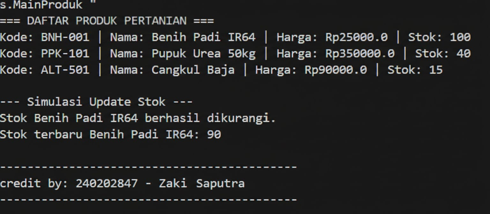

# Laporan Praktikum Minggu 1 (sesuaikan minggu ke berapa?)
Topik: [Tuliskan judul topik, misalnya "Class dan Object"]

## Identitas
- Nama  : [Zaki Saputra]
- NIM   : [240202847]
- Kelas : [3IKRA]

---

## Tujuan
(
1. Mahasiswa mampu menjelaskan dan mengimplementasikan konsep class, object, atribut, dan method.

2. Mahasiswa mampu menerapkan enkapsulasi menggunakan access modifier private serta getter dan setter.

3. Mahasiswa mampu melakukan instansiasi objek dan menampilkan data produk pertanian pada console.

4. Mahasiswa mampu mengelola repositori kode menggunakan Git dan GitHub*)

---

## Dasar Teori
(
1. Class: Merupakan cetak biru (blueprint) yang mendefinisikan atribut dan perilaku (method) dari suatu entitas.

2. Object: Bentuk nyata (instansiasi) dari sebuah class yang menempati memori.

3. Enkapsulasi: Mekanisme menyembunyikan data sensitif menggunakan modifier private agar hanya bisa diakses melalui method public (getter dan setter).

4. Access Modifier: Pengaturan hak akses (seperti public dan private) untuk menjaga integritas data di dalam class.)

---

## Langkah Praktikum
(
1. Persiapan Folder: Mengatur struktur package sesuai standar yaitu com.upb.agripos.model dan com.upb.agripos.util.

2. Coding Class Model: Membuat file Produk.java yang memiliki atribut privat (kode, nama, harga, stok) dan method pengelola stok.

3.  Coding Class Utility: Membuat file CreditBy.java dengan method statis untuk menampilkan identitas di akhir program.

4. Main Program: Membuat MainProduk.java untuk membuat 3 objek (Benih, Pupuk, dan Cangkul) serta menampilkan datanya.

5. Version Control: Melakukan git add ., git commit -m "week2-class-object", dan git push ke GitHub.)

---

## Kode Program
(Tuliskan kode utama yang dibuat, contoh:  

// Contoh Instansiasi di MainProduk.java
Produk p1 = new Produk("BNH-001", "Benih Padi IR64", 25000, 100);
Produk p2 = new Produk("PPK-101", "Pupuk Urea 50kg", 350000, 40);

// Menampilkan data menggunakan Getter
System.out.println("Kode: " + p1.getKode() + ", Nama: " + p1.getNama());

// Memanggil CreditBy
CreditBy.print("240202847", "Zaki  Saputra");
)
---

## Hasil Eksekusi
(Sertakan screenshot hasil eksekusi program.  

)
---

## Analisis
(
- Alur Kerja: Kode berjalan dengan mengawali pembuatan objek melalui constructor. Data yang diinputkan disimpan ke dalam atribut privat, lalu diambil kembali menggunakan getter untuk ditampilkan ke layar.

- Perbedaan: Jika minggu sebelumnya kode mungkin ditulis secara prosedural dalam satu file, minggu ini kode dipisah menjadi beberapa class (modular), sehingga lebih teratur dan mudah dikelola.

- Kendala: Terdapat kendala pada embedded git repository saat melakukan push, namun berhasil diatasi dengan menghapus folder .git di dalam subfolder dan melakukan force push untuk membersihkan indeks.  
)
---

## Kesimpulan
(Penggunaan konsep Class dan Object memungkinkan representasi dunia nyata (seperti produk pertanian) ke dalam program secara terstruktur. Dengan enkapsulasi, keamanan data lebih terjamin karena akses variabel dikontrol secara ketat melalui method.*)

## Quiz
(1. [Mengapa atribut sebaiknya dideklarasikan sebagai private dalam class?]  
   **Agar data tidak dapat diakses langsung dari luar class dan hanya dapat dimodifikasi melalui method khusus getter dan setter, sehingga menjaga keamanan dan konsistensi data.**
 …  

2. [Apa fungsi getter dan setter dalam enkapsulasi?]  
   **Getter digunakan untuk mengambil nilai atribut, sedangkan setter digunakan untuk mengubah nilai atribut secara terkontrol**…  

3. [Bagaimana class Produk mendukung pengembangan aplikasi POS yang lebih kompleks?]  
   **Class Produk menjadi dasar model data untuk aplikasi POS karena dapat diperluas dengan fitur tambahan seperti kategori, diskon, transaksi, atau manajemen stok otomatis tanpa perlu mengubah struktur utama program.** …  )
